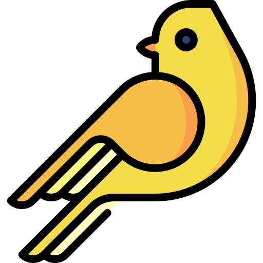

<h1 align="center">canary</h1>

<div align="center">
	
</div>


## About
`canary` is a simple command line tool that recursively transverses path given for all video, 
image, or text files of a specified criteria.

## Installation
This project is managed with [Python Poetry](https://github.com/python-poetry/poetry). With Poetry 
installed correctly, simply clone this project and run:

```
poetry install
```
To test the project, run:

```
poetry run pytest
```

## Commit Conventions
Git commits follow [Conventional Commits](https://www.conventionalcommits.org) message style as
explained in detail on their website.

<br/>
<sup>
    <a href="https://www.flaticon.com/free-icons/bird" title="bird icons">
        canary icon created by Freepik - Flaticon
    </a>
</sup>
